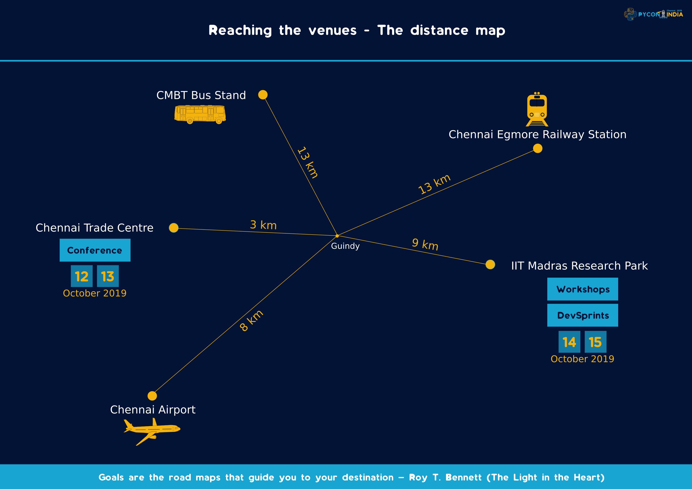
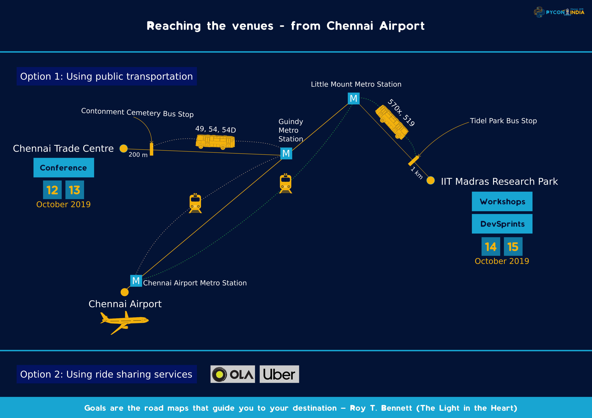
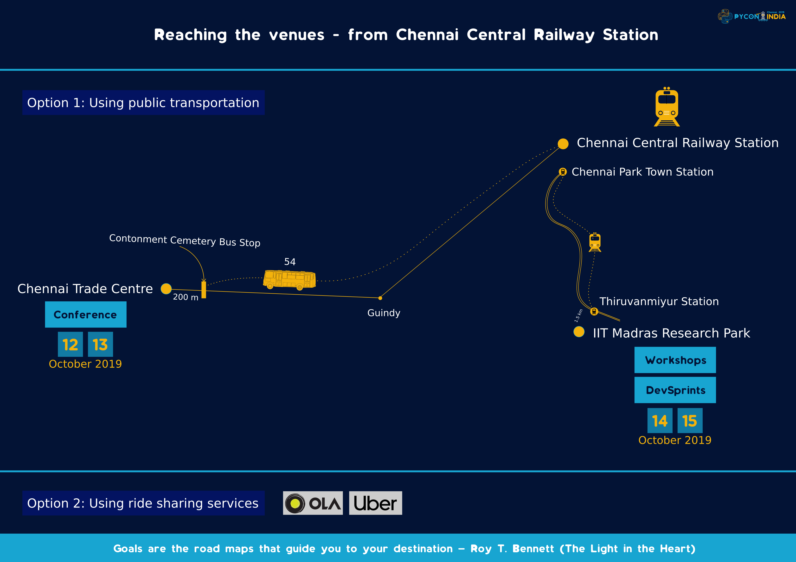
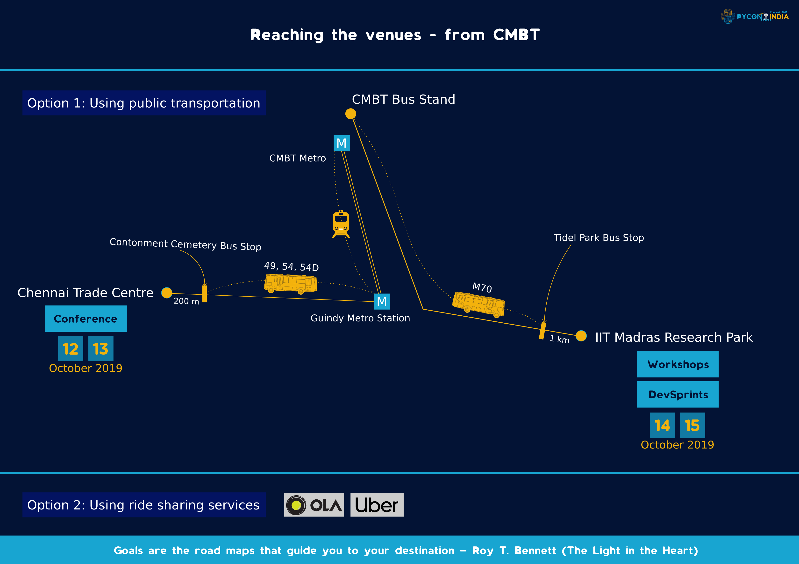

This page is to help the attendees reach Chennai and the conference venues.

 

### Getting to PyCon India 2019

 

     

#### **By Plane**
 

Chennai has an international airport that is well connected to Europe, the Middle East, US,
and South East Asia. It is also well connected by domestic flights.

     

**Chennai Trade Center(Conference)**

The easiest option is to take a metro from Chennai Airport towards Washermenpet Metro and alight
at Guindy Metro. From the metro station, you can board one of these buses - 49, 54, 54D and
get down at Contonment Cemetery. The venue is 200 meters from here. Alternatively, you can hail
a cab from ride sharing services like Uber or Ola. Please **do not** try to get an autorickshaw
as they usually rip off outsiders. Same goes for rental cabs at the airport as well.

**IITM Research Park(Workshops and Dev Sprints)**

Again, the easiest option is to take a metro towards Washermenpet and alight at Little Mount Metro.
From there, you can take a bus towards Thiruporur(519) and alight at TidelPark. IITMRP is exactly
behind Ramanujam IT Park. The distance from tidelpark bustop is 1Km

 

---

 

#### **By Train**
 

     

Chennai's Central Railway Station is where you will most probably arrive. 

**Chennai Trade Center(Conference)**

The simplest way is to take a bus towards Poonamallee(bus route 54) and alight at Contonment
Cemetery(or ask for Chennai Trade Center itself). It's an hour's ride and the venue is about 200
meters from the bus stop.

**IITM Research Park(Workshops and Dev Sprints)**

From Chennai Central, you can take a metro ride to Saidapet Metro and catch a bus
towards Tidel Park and alight at Tidel Park Bus Stop. The bus routes are 19A, 19BCT, 221H, M19B. 

From Chennai Central Walk Towards Park Town MRTS station, take a train towards Velacheary and
get down at Thiruvanmiyur MRTS Stop. Ramanujam IT Park is close to this
station and the entrance to IITMRP is just behind this.

 

---

 

#### **By Bus**
 

     

Chennai CMBT is the central bus stand where all buses arrive. This has two bus stands - one
for government and one for private buses. The directions are given from the government bus stand.

**From CMBT to the venues**

**Chennai Trade Center(Conference)**

You can catch a metro to Guindy Metro Station and board one of these buses - 49, 54, 54D and
get down at Contonment Cemetery. The venue is 200 meters from here.

**IITM Research Park(Workshops and Dev Sprints)**

You can reach IITMRP using the bus route M70 and get down at Tidel Park bus stop.
From Tidel Park Bus Stop you can walk towards backside of Ramanujam IT Park.
IITMRP is exactly behind Ramanujam IT Park.

 

---

 

#### **Please note**

* Autorickshaws in Chennai **do not** use meters. Prefer using Uber or Ola in their place. Chennai
  has a good coverage in terms of public transport and you can easily reach any part of the city
  by using buses and trains.

* If you are travelling by cabs, it's a better idea to get down at IIT Madras Research Park Entrance
  rather than the regular IIT-M Entrance.
